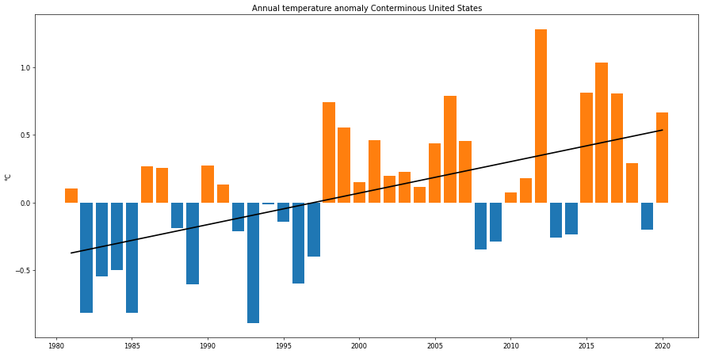
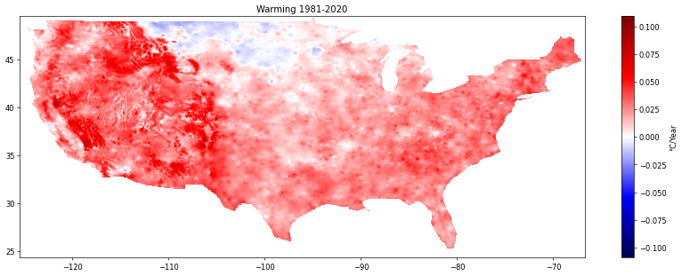

# Characterizing climate change

This is a demo script to illustrate the power of PAIRS. While forecasting climate change is an ongoing and complex research topic, we can use PAIRS to find out how much the climate has changed in the last 4 decades.

Specifically, we will analyse daily average temperatures as reported by the [PRISM Climate Group](https://prism.oregonstate.edu/) for the Conterminous United States. At first, we will do a fairly conventional analysis, aggregateing the daily temperature anomaly across the entire area. This will give us a statistically robust idea of the total degree of warming.

Exploiting PAIRS however, we can drill deeper. Specifically, we will do the same analysis at each pixel. Doing so we will find that different parts of the country are affected to different degrees.

