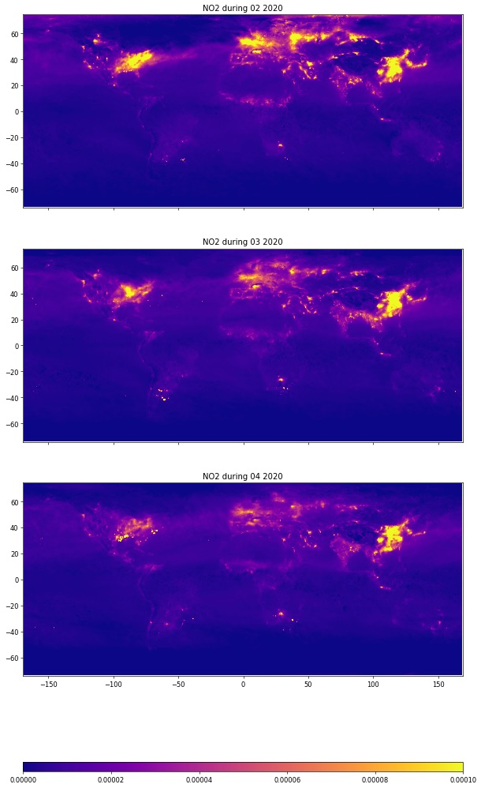

# Impact of Covid-19 on Climate and Pollution

Nitogren dioxide (NO2) is a generated when burning fossil fuels, most notably in internal combustion engines. While there are also a few natural processes that release NO2, its presence in the atmosphere is a clear indicator of economic and human activity. The gas has various negative environmental effects. When reacting with water molecules in the atmosphere, it causes acid rain, which in turn harms sensitive ecosystems in lakes and forests. It also forms nitrate particulates contributing to nitrient pollution in coastal waters.

The global Covid-19 pandemic lead to an ongoing series of so-called shutdowns, government ordered mandates for people to stay at home as much as possible to limit further spread of the virus. These in turn led to reduced economic activity.

The aim of this notebook is to showcase the impact of these shutdowns on economic activity, as exhibited by changing NO2 content in the atmosphere. To do so, we will use measurements from the European Space Agency's (ESA) Sentinel 5 satellites. These monitor NO2, yet also ozone, methane, formaldehyde, aerosols, carbon monoxide and SO2 gases in the earth's atmosphere. Their data can be accessed via IBM PAIRS Geoscope.

