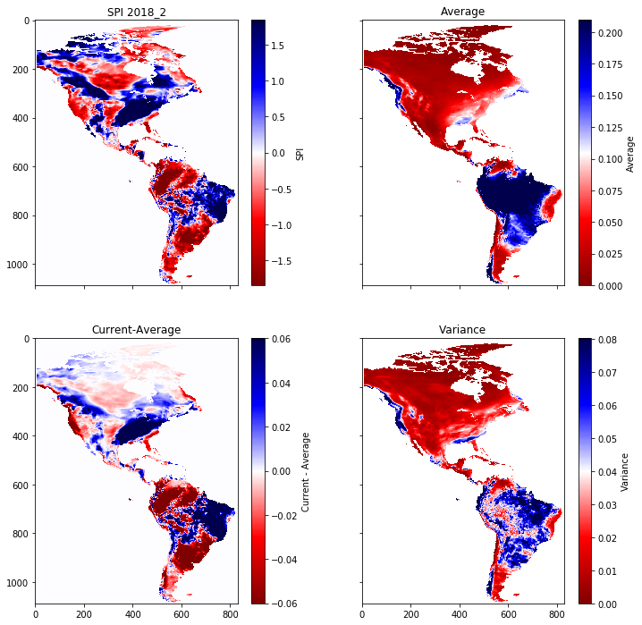

# Standardized Precipitation Index (SPI)

The Standardized Precipitation Index (SPI) is the excess precipitation in a region compared to the historical average, divided by the variance of the historical average. The SPI indicates areas of statistically significant excess or deficit of precipitation. It is defined as

SPI = (P - Pave)/sigma

Calculating the SPI requires aggregating years of historical data. We push this part of the analytics into a set of PAIRS queries that calculate averages and variances. Subsequently we obtain the SPI after a small amount of additional operations that are done locally.

The result for North and South America in February 2018 is shown in the figure, with the SPI in the upper left, the average percipitation in the upper right, the differnce between the February 2018 precipitation and the average in the lower left, and the variance in the lower right. 

References:
- https://climatedataguide.ucar.edu/climate-data/standardized-precipitation-index-spi
- http://www.wamis.org/agm/pubs/SPI/WMO_1090_EN.pdf
- https://journals.ametsoc.org/doi/10.1175/2009JCLI2909.1
