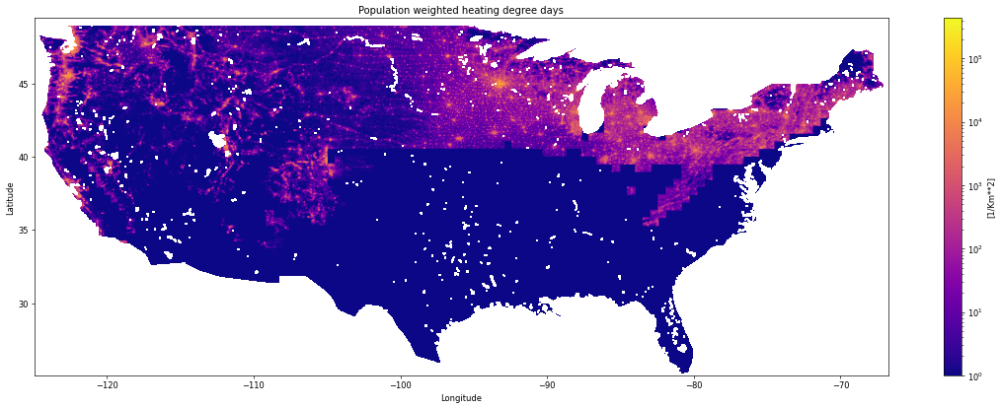
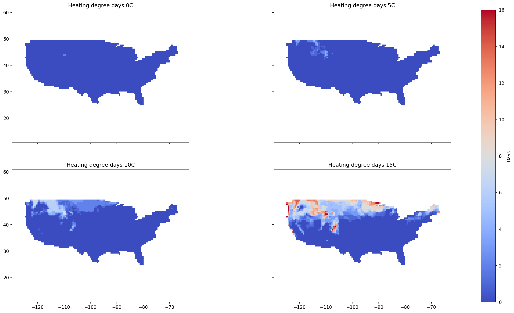

# Energy trading

The notebooks in this repository [hdd.ipynb](hdd.ipynb) and [popWeightHDD.ipynb](popWeightHDD.ipynb) calculate [heating degree days](https://en.wikipedia.org/wiki/Heating_degree_day), a proxy for energy consumption, as well as population-weighted heating degree days. The assumption is that people start heating their homes once temperatures drop below a certain threshold. By counting the number of such days one can anticipate energy use.Since PAIRS calculates these dynamically, it is possible to compare the effect of differnt threshold values.

Note that the example of the population-weighted calculation showcases an essential feature of PAIRS: The ability to effortlessly combine very different data layers obtained from different data providers at highly different resolutions.

