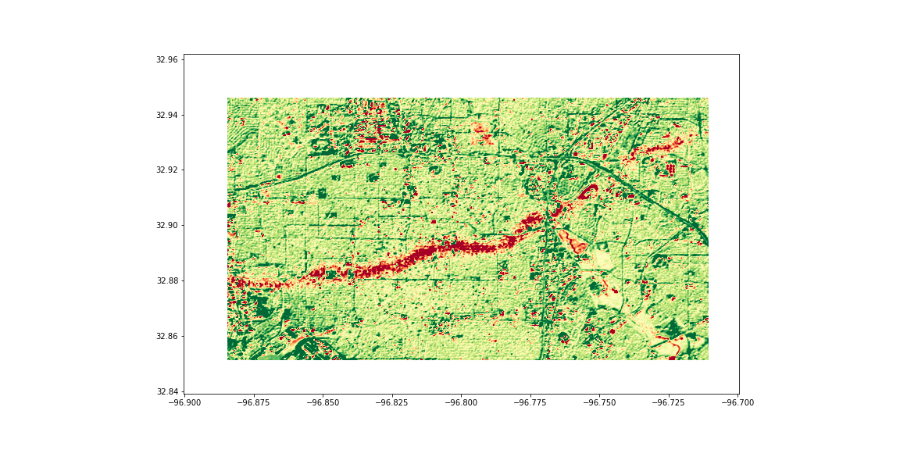

# Tornado path identification

This is a very simple example how the path of a tornado can be identified using PAIRS leveraging its user-defined functions. On 10-20-2019 a major tornado went right through Dallas, TX (https://watchers.news/2019/10/25/ict-2019-dallas-tornadoes-the-costliest-tornado-event-in-texas-history-usa/). This notebook extracts the path of the tornado from the red band of ESA's Sentinel 2 satellites. (PAIRS layer `49360`.)
