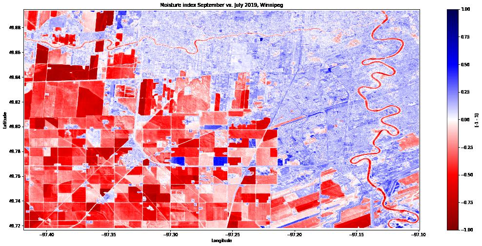
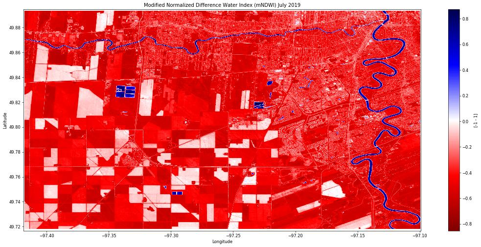

# Calculating water and moisture indices from Sentinel 2 data

PAIRS allows to execute arbitrary math operations on data layers via *user defined functions* (UDFs). This example uses this feature to calculate moisture and water indices from Sentinel 2 data.

The general idea behind these indices is that water reflects less radiation in the infrared range than other land cover. While it is hard to extract moisture content -- or even just the presence of water bodies -- from raw satellite data (whether in the visible part of the optical spectrum or not), these indices allow to obtain such information much more clearly.

The above shows differences in moisture indices between July and September 2019 near Winnipeg. Note how agricultural areas clearly show a decrease in moisture. Using a second PAIRS query, this notebook shows that these are essentially the areas with a decrease in vegetation during the same time period, suggesting that the drop in moisture content is due to harvest.

The below plot on the other hand shows the modified Normalized Difference Water Index (mNDWI) for July. Identifying water bodies becomes a trivial exercise -- especially when compared to raw satellite data. This is useful when monitoring water bodies for e.g. volume changes.

## References

There are a number of different water indices. See the following references for additional information see e.g.
- https://en.wikipedia.org/wiki/Normalized_difference_water_index
- McFeeters, S.K. The use of the Normalized Difference Water Index (NDWI) in the delineation of open water
features. Int. J. Remote Sens. 1996, 17, 1425–1432.
- Xu, H. Modification of normalised difference water index (NDWI) to enhance open water features in remotely
sensed imagery. Int. J. Remote Sens. 2006.
- Feyisa, G.L.; Meilby, H.; Fensholt, R.; Proud, S.R. Automated Water Extraction Index: A new technique for
surface water mapping using Landsat imagery. Remote Sens. Environ. 2014, 140, 23–35. 

In the following we will calcuulate mNDWI, NDMI, AWEInsh and AWEIsh in a single query.
