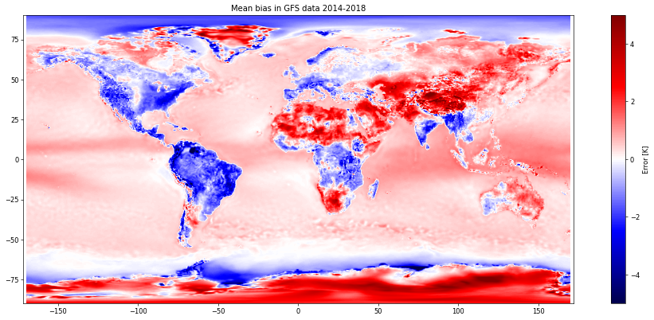
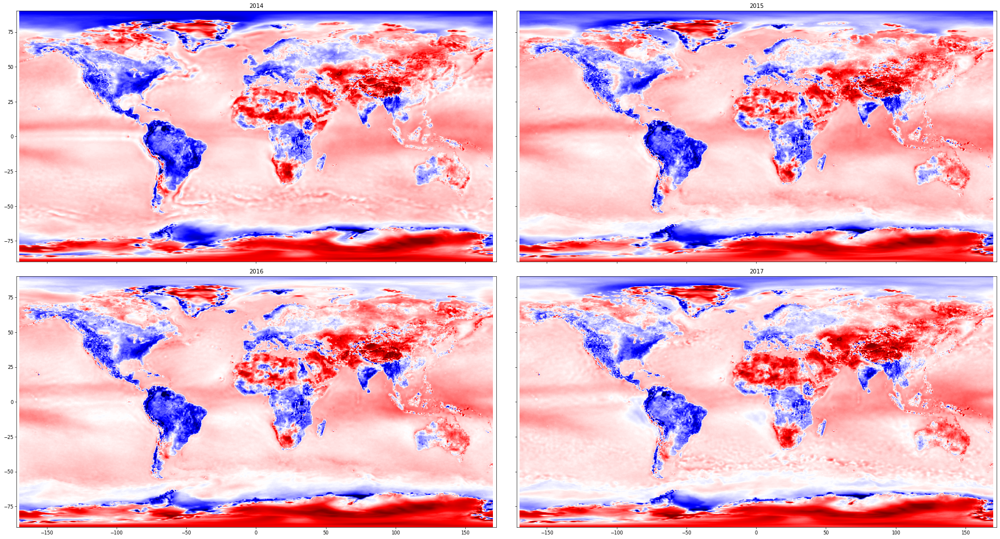
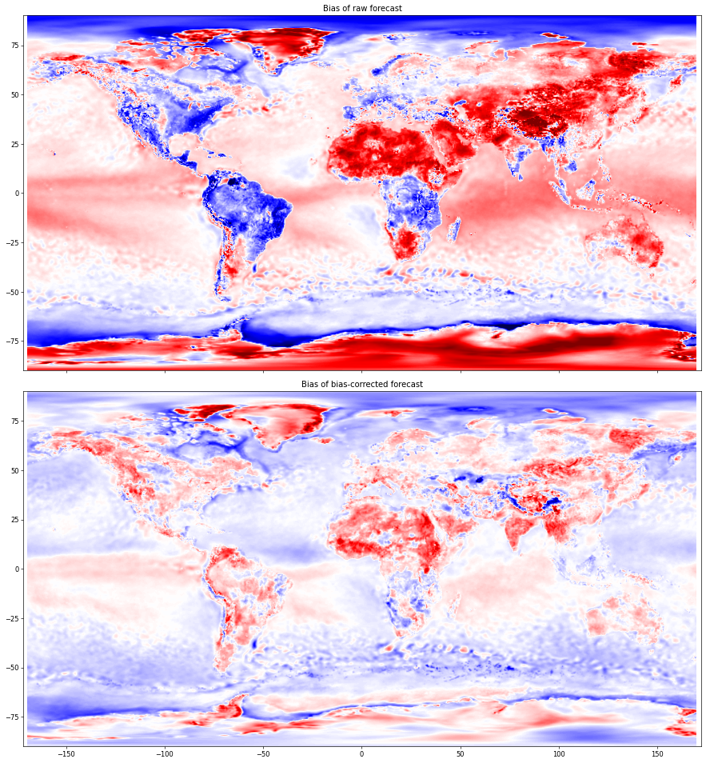

# Bias-correction of a weather forecast

The above jupyter notebook [biasCorrection.ipynb](./biasCorrection.ipynb) uses IBM PAIRS to study and correct biases in the GFS forecast. In detail, we will compare the temperature forecast made by NOAA's GFS with the ERA5 reanalysis. Aggregating 5 years worth of data will give evidence of a systematic yet location-dependent bias in the GFS data. We will then use PAIRS to remove these biases from the GFS forecast, leading to an MAE reduction of roughly 50%.

## Results

The overall bias in the GFS forecast with 6 hours lead time over the 5-year period from 2014 to 2018 is

Note that this appears to be independent of the aggregation period. I.e. if one calculates the bias for each year individually, one obtains the following result

Subtracting the bias of the 2014-2018 period from forecasts for the first half of 2019 brings us to the following:

