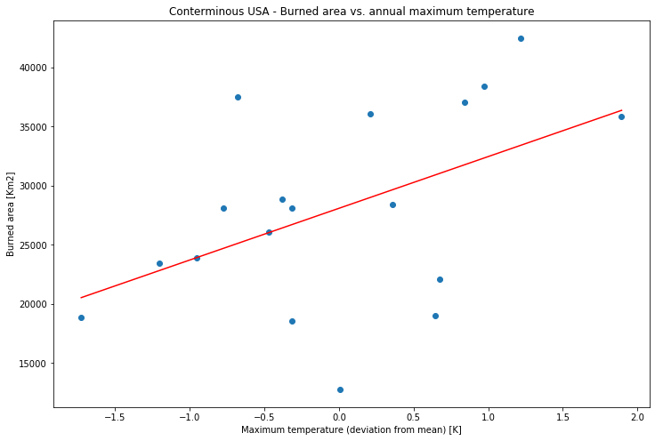
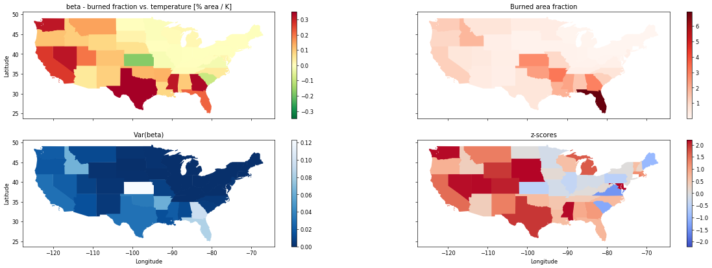

# Wildfire statistics

PAIRS layer 50035 contains information on burned areas. I.e. a pixel has the value 1 on the timestamp a burn occured. (The data is derived from http://modis-fire.umd.edu/ba.html.) Leveraging the spatial and temporal aggregation features in PAIRS allows us to calculate burned areas for each state in the US per year.

To analyze the data, we compare it with daily maximum temperatures as reported by PRISM.

Subsequently we make a more careful analysis by state. To make a meaningful comparison between states, we normalize the area in each state affected by fires by the _burnable area_, i.e. area for which the land use suggests that a fire would be possible.

