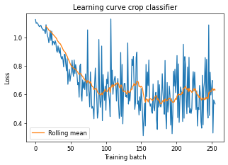

# Crop ID

This notebook uses data from NASA's Aqua and Terra satellites to identify crops across Iowa.

To do so, we will train a simple neural network leveraging NDVI data from NASA's Aqua and Terra satellites (PAIRS layers 51 and 71) to identify crops across the state. The ground truth is given by USDA's cropscape data (PAIRS layer 111).

